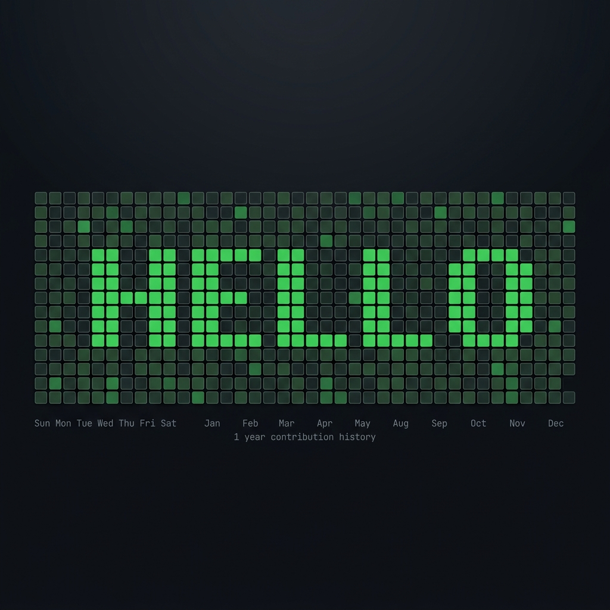
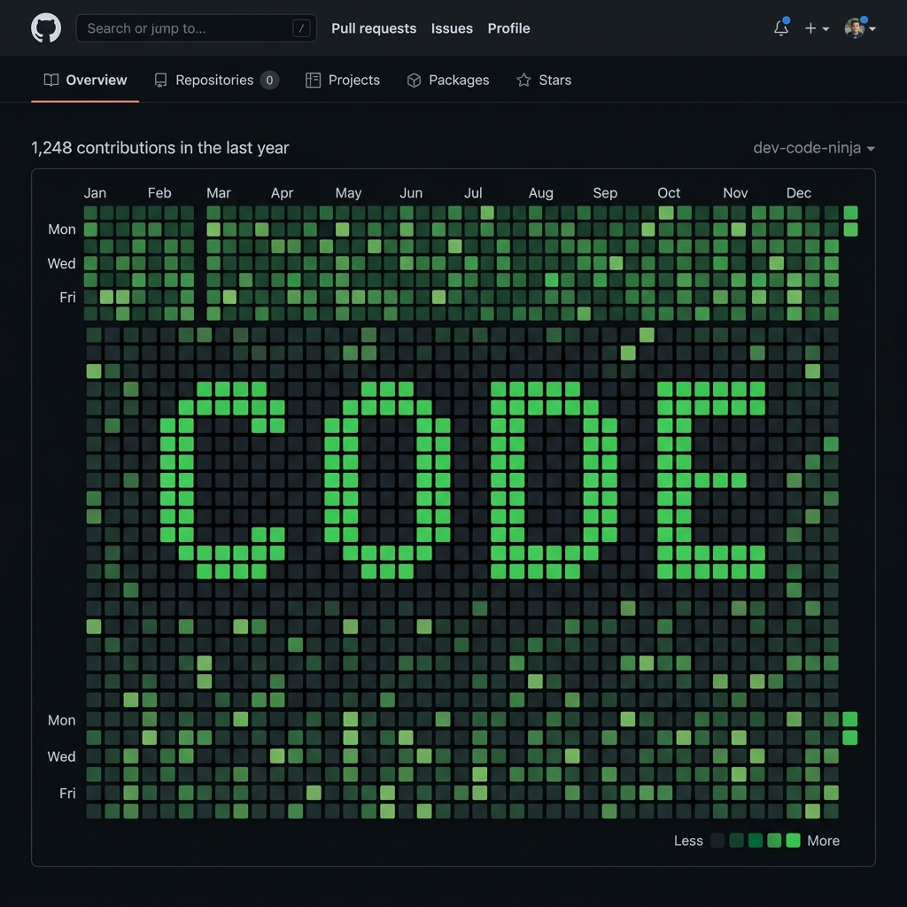
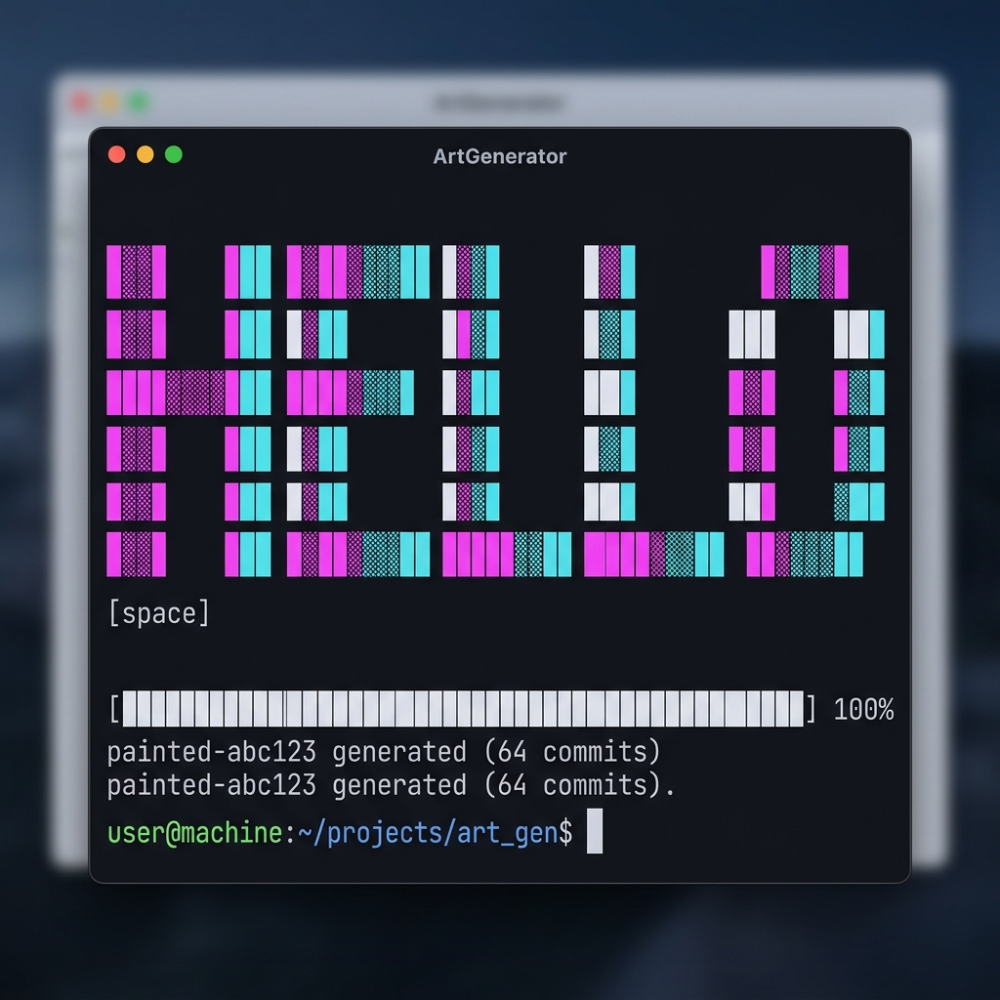

# Git Commit Painter 🎨

<p align="center">
  
</p>

<p align="center">
  <strong>Paint pixel art on your GitHub contribution graph using real commits.</strong>
</p>

<p align="center">
  <a href="https://www.npmjs.com/package/git-commit-painter"></a>
  <a href="https://github.com/dhirenderchoudhary/git-commit-painter/blob/main/LICENSE"></a>
</p>

---

## What It Does

Turn your boring GitHub contribution graph into art. Write your name, draw patterns, or make your entire year look green — all with real git commits.

<p align="center">
  
</p>

## Installation

```sh
npm i -g git-commit-painter
```

## Prerequisites

- **Git** installed and configured
- **Node.js** (v14+)

## Quick Start

1. Create a **new, empty** GitHub repository and copy its URL.
2. Run the painter:

```sh
git-commit-painter -t <text> --multiplier <factor> --push --origin <repo_url>
```

**Example:**
```sh
git-commit-painter -t hello --multiplier 10 --push --origin https://github.com/dhirenderchoudhary/hello.git
```

> 💡 The `--multiplier` flag scales commit intensity so the painted text stands out against your existing activity.

### Terminal Output

<p align="center">
  
</p>

## All Options

```sh
git-commit-painter --help
```

| Flag | Description |
|---|---|
| `-t, --text <string>` | Text to render on the graph |
| `-f, --file <path>` | Path to a custom JSON pattern |
| `--font <name>` | Typography style (see below) |
| `-s, --startdate <YYYY-MM-DD>` | Custom start date (snaps to Sunday) |
| `-m, --multiplier <n>` | Scale commit intensity |
| `-i, --invert` | Invert shade values |
| `--flipvertical` | Mirror vertically |
| `--fliphorizontal` | Mirror horizontally |
| `-o, --origin <url>` | Remote repository URL |
| `-p, --push` | Push to origin after generating |
| `--force` | Force push |

## Typography Styles

Custom typography styles are in `src/typography/`.

```sh
git-commit-painter -t <text> --font <font_name>
```

**Example:**
```sh
git-commit-painter -t Wald0 --font bold_edge
```

**Available:** `retro_block` · `digital_segment` · `arcade_pixel` · `bold_edge`

## Custom Patterns

Create a JSON file where numbers 1–4 control shade intensity:

```json
[
    "  333  ",
    " 3   3 ",
    "3 2 2 3",
    "3     3",
    "3 222 3",
    " 3   3 ",
    "  333  "
]
```

Then paint it:
```sh
git-commit-painter -f path/to/pattern.json --origin <repo_url> --push
```

A sample `space-invaders.json` template is included in `src/templates/`.

## Start Date

By default, painting begins 53 weeks before the current date (filling one full year). Override with:

```sh
git-commit-painter --startdate 2024-01-01 ...
```

The date is automatically snapped to the nearest Sunday.

## Multiplier

```sh
git-commit-painter -m 15 ...
```

Higher values produce darker shades on the heatmap — useful when your existing contribution count is already high.

## How It Works

1. Creates a temporary git repo with empty commits
2. Each commit is backdated to the correct day on the contribution graph
3. The number of commits per day controls the green shade intensity
4. Push the repo to GitHub and the art appears on your profile

## License

MIT © [dhirenderchoudhary](https://github.com/dhirenderchoudhary)
